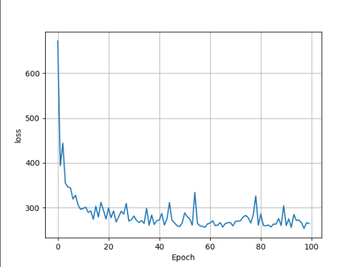
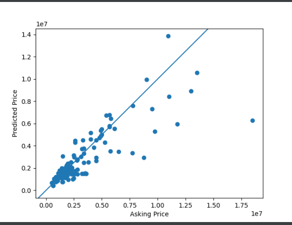
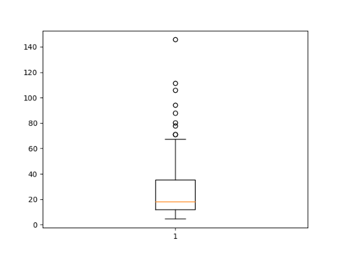

`Question 1`

#### How did your model fare?

 

In terms of my loss model, the loss was not very consistent, but it seemed to generally decrease as the epoch increased, compared to the beginning.
For my asking vs predicted price data, my MSE was **_really_** bad with an MSE of around 1407. I think I would have had better luck with another city.
The MSE gave me such a hard time while I was trying to find out what was causing it to be so high.
I tried plotting histograms and switching values but nothing made much difference to it. I tried having four variables (included the zipcode), but this didn't make much difference to the MSE. I then tried to replace the livingArea by the zipcode, and that made my MSE ridiculously larger. I then tried to just segment my price value. I only included houses that were below $6,000,000. This managed to decrease my MSE to around 1010. This is still huge, but better than what i initially had. My I only had 135 houses, and after i limited my price range to below 6 million, I ended up with 91. This is such a small set. I am sure I would have had better luck if my data set was bigger, or if I picked another city that might have variables that were better closely related. 
Referring to the loss model, the prices seem to be predictable and the model is doing the best from 0 to $5,000,000 in asking price. After that, it becomes less predictable.

`Question 2`

#### In your estimation is there a particular variable that may improve model performance?
Probably location; zipcode or neighborhood, seeing as these tend to increase house prices 

`Question 3`

#### Which of the predictions were the most accurate? 
Most accurate was in index 12, where the asking price was $1,795,000 and the predicted price was $1,794,299.
#### In which percentile do these most accurate predictions reside? 
They reside in the 25th percentile. I was able to see that by plotting a box plot of the predictions. 

#### Did your model trend towards over or under predicting home values?
My model seemed to trend over my predicting home values. 

`Question 4`

#### Which feature appears to be the most significant predictor?
I found living area to have the best correlation with my predictions (0.83). Therefore, it appears to be the most significant predictor. This makes sense as I expect the area to play a big role in determining house prices. 