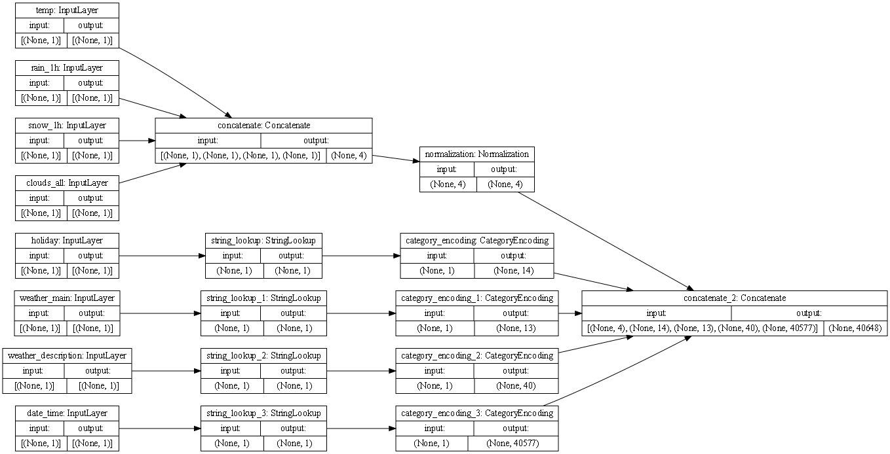
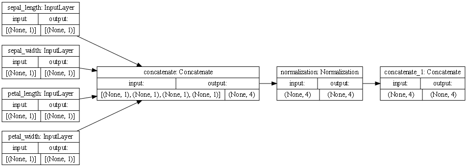

#### Use the plot_model() command from tf.keras.utils to produce the plot that describes the input preprocessing step.

#### Describe the plot of each model for the two dataset preprocessing steps. What does each box in the illustration represent? Are there different paths towards the final concatenation step? What is occurring at each step and why is it necessary to execute before fitting your model. What is occurring at each step and why is it necessary to execute before fitting your model.

Each box represents a preprocessing layer!

The first line of boxes:

both the **Metro Interstate Traffic Volume dataset** and the **iris dataset** has the inputs/features of each dataset.

The second line of boxes:

In the traffic dataset, four inputs are continuous (temp, rain_1h, snow_1h, clouds_all) and are concatenated immediately into one output of (None,4), and four inputs are _not_ continouous (holiday, weather_main, weather_description, date_time). These are categorical and a date time type of input; these don't get concatenated right away, but get processed into StringLookup, which maps the inputs from strings to integer indices. 
In the iris dataset, all inputs are numerical and immediately get concatenated.

Third line of boxes:

In the traffic dataset, the concatenated inputs get normalized, while the non-numerical inputs go to CategoryEncoding which creates a one-hot vector for each input.
In the iris dataset, all inputs go into normalization

Fourth line of boxes (the final step):

In the traffic dataset set, there are different paths that lead to the final concatenation step; four coming from all the different categorical inputs and one path coming from the numerical normalized inputs, eventually they all get grouped into one output (None, 40648)
In the iris dataset, there is only one path leading to the final concatenation step, with an output of (None, 4)

It is necessary to execute before fitting the model because of the differences in our inputs; we have a lot of different ranges and types of inputs that need to be processed before the model can be fit.

####  Train each model and produce the output (not necessary to validate or test). Describe the model output from both the metro traffic interstate dataset and the iris flowers dataset. 

After training, the traffic dataset had a loss of: 3538236.2500, while the iris dataset had a loss of: 0.2150.
This shows that the iris dataset is doing better, but that is probably because it's simpler than the metro traffic dataset, which probably needs a lot more training.

#### What is the target for each dataset?
The target for the metro traffic dataset was 'traffic_volume', for the iris dataset it was 'speices'

####  How would you assess the accuracy of each model? 
Based on the loss values, the iris dataset is a lot more accurate than the metro traffic dataset, which as I mentioned, probably needs a lot more training.

####  Are you using a different metric for each one? Why is this so? What is each one measuring?
Meansquarrederror for the metro dataset, because we are measuring the traffic, or cars -- so a mean value can be taken
BinaryCrossentropy for the iris dataset, because we are measuring the probability of the presence or absence of a species of iris (0 or 1)

