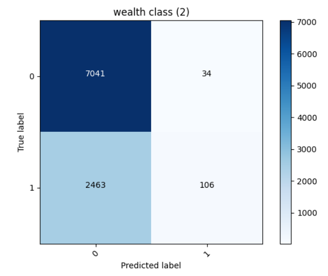
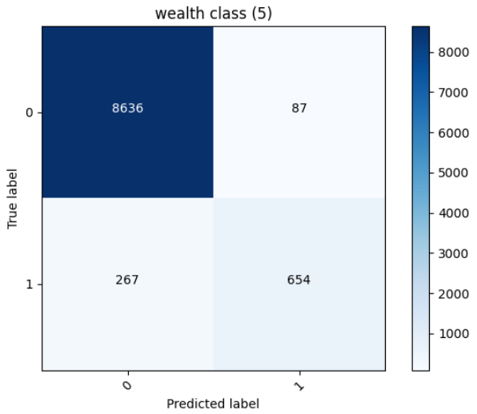
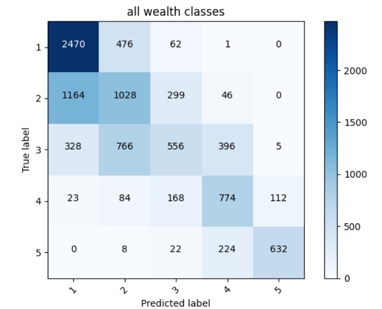
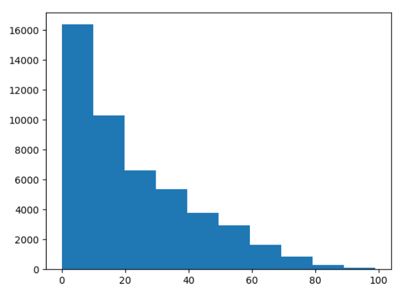
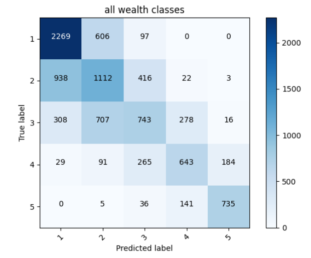

I first created a simple model with only numeric and indicator columns and got the following accuracies:

wealth (1) = 0.7937577962875366

wealth (2) = 0.7382828593254089

wealth (3) = 0.8051638603210449

wealth (4) = 0.8929904699325562

wealth (5) = 0.9572791457176208

I tried to make my simple model more accurate, and I did so by bucketizing age and introducing some embedding feature columns. I tried crossing columns but my accuracy only went down. So I decided not to cross any.

My accuracies increased to the following:

wealth (1) =  0.7958316206932068

wealth (2) =  0.7410825490951538

wealth (3) =  0.793861448764801

wealth (4) =  0.902633786201477

wealth (5) =  0.9632932543754578

___

Least was 2nd wealth class with accuracy 0.7410825490951538 with the confusion matrix:

it looks like most of the correctly predicted classes were the "not wealth class 2", which makes sense because they had a higher probability of being chosen because they were more. It looks like the 2nd wealth class was correctly predicted 106 times, and incorrectly predicted 2463 times.

Most accurate was the 5th wealth class with Accuracy 0.9632932543754578 with the confusion matrix:

Here, too, it looks like the other wealth classes were predicted more than our target wealth class. Which, again, makes sense because they had a higher probability and were higher in number. The wealth class 5 was correctly picked 654 times and incorrectly predicted 267 times. This is much better than the wealth class 2.

___

All wealth classes together Accuracy 0.5661551356315613

In an attempt to make this accuracy higher, I tried crossing columns again, but that still did not produce a better accuracy; instead, it went down. So I produced a histogram for age to see if perhaps I could divide my boundries better 

based on this, I changed my boundries to be more spaced out as the age increased; because it was clear that there were a lot more people aged under 10.

After I changed my boundries, my accuracy increased a little: **0.5705101490020752**

This showed that perhaps the age-boundries played a role in predicting our wealth classes

I then tried to do the opposite and just take out columns from my indicator columns, sure enough my accuracy went down to around ~33% and ~47%. So I hypothesized that perhaps I'm having a hard time increaseing my accuracy because I fixed my data a little earlier (when i increased my simple model accuracy by a few percentages). That being said, although my accuracy did increase a little, I am sure it can go higher than that with some more work.

