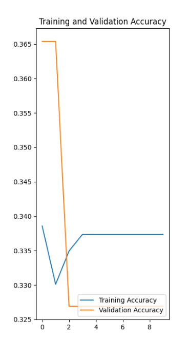
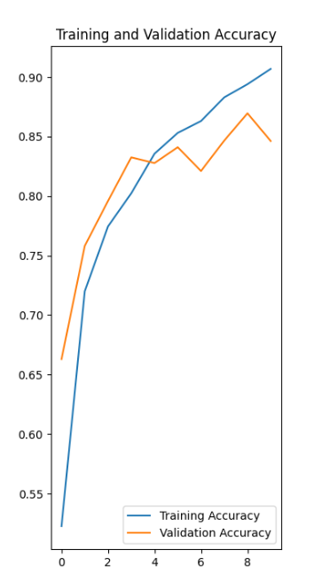

`1`

#### - Using the relevant parts from the entirety of the example script as a guide, fit a CNN model to your training data and validate using the beans dataset from Tensorflow datasets and then again train and validate using the eurosat dataset. Present your results and discuss the accuracy of each of model

### **_un-augmented BEAN_**

For the un-augmented bean dataset, I ran 6 epochs, I am sure I could have gotten a better accuracy if I ran for more epochs, but my computer was very slow.

**Results:**

Accuracy: 0.8573

Val Accuracy: 0.6923

Test Accuracy: 0.7379

### **_un-augmented EUROSAT_**

For the un-augmented eurosat dataset, I first ran 6 epochs as well, when I saw that they ran relatively faster, I changed my epochs to 36. 

**Results:**

Accuracy: 0.9906

Val Accuracy: 0.8467

Test Accuracy: 0.8489

* For both datasets, the Test accuracy was higher than the validation accuracy; although, in the eurosat, the difference was not very big. 
Also, both models were overfit, with the bean model being a lot more overfit than the eurosat-- I'm assuming that is due to me running them on different epochs (eurosat had more epochs than beans)
  

___
`2`

#### - Did your model performance improve? How many epochs were you able to run and how much time did it take? Present your results and discuss the accuracy of your augmented output for tomorrow's class. 

- ### **_augmented BEAN_**

**Results:**

Train accuracy: 0.3398

Val accuracy: 0.3269

My results look very bad. My model's preformance did not improve, even though I ran the augmented BEAN dataset with 10 epochs (the un-augmented was run on 6 epochs). This model did very poorly. 

My 10 epochs on the augmenented bean dataset each took about 7 minutes to run.

### **_augmented EUROSAT_**

**Results:**

Train accuracy: 0.8941

Val accuracy: 0.8696

My model did slightly improve in this one from the un-agumented model. It's also obvious that my augmeneted eurosat did better than my augmented bean dataset, because of the higher accuracies!

I also ran 10 epochs here, with each epoch taking about a minute and a half to run (which was faster than the augmented-bean epochs)

So, overall, the eurosat dataset did better than the bean dataset both as augmeneted and unaugmented.

___

My biggest challenge with this code was honestly how slow it ran on my computer. Also, when I left it to run, it slowed down my entire computer and it was almost impossible to use it for anything else. So that was definitely a limitation. I am sure I could have done better with more epochs..