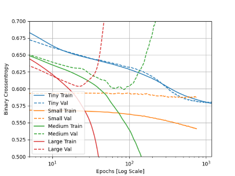
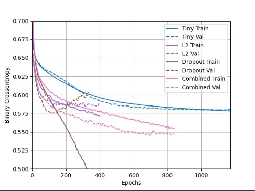

`1`

#### - Describe the dataset. 
It's a particle-physics dataset with 11,000,000 examples. 
#### - What type of variable is the target? 
it's a continuous variable
#### - How many features are being used? 
28 features.
#### - How many observations are in the training dataset? How many are used in the validation set?
10,000 observations in the training, and 1,000 in the validation.
_______
`2`

#### - How did each of the four models perform (tiny, small, medium and large)? 

The **tiny** model did very well; both metrics were moving in the same direction and were close together.
The **small** model was close to overfitting; because the validation model began to stagnate while the training metric was still improving
The **medium** and **large** models were clearly overfitting; both had the validation and training metrics moving in complete opposite directions.

#### - Which of the four models performed the best? Which ones performed the worst? 
The small model performed the best, the medium and large performed the worst.

#### - Why in your estimation did certain models perform better? 
I think the tiny and smaller models performed better because simpler models are less complex and have fewer parameters-- the smaller values minimized the distribution
#### - Produce a plot that illustrates and compares all four models.
_________________
`3`

#### - Apply regularization, then add a drop out layer and finally combine both regularization with a dropout layer. Produce a plot that illustrates and compares all four models. Why in your estimation did certain models perform better?

I believe the combined L2 + dropout did better because it utilized both regularization techniques at once. Penalized the weight parameters as well as dropping out some output features as the model trained.
_________________
`4`

#### - What is an overfit model? 
an overfit model is one that is trained too closely to a specific set of points that it doesn't preform very well with new data points. An overfit model has a better training model than test/validation model.
#### - Why is it important to address it? 
because an overfit model does not do well on new data, overfitting affects the model's ability to generalize what it learnt from training to any new data.
#### - What are four different ways we have addressed an overfit model thus far?
1. L1 regularization
2. L2 regularization
3. dropout
4. L2 and dropout combined 