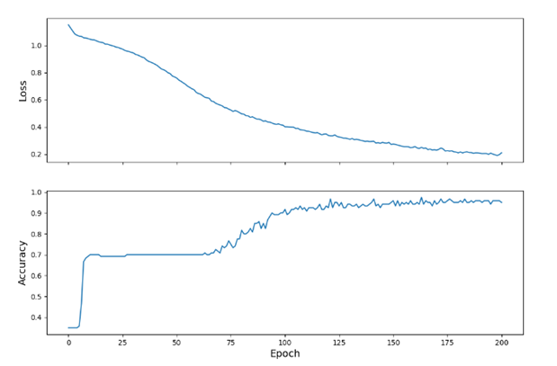

The data in the model is iris_training.csv, it’s a plain text file, with comma separated values. It has information about 3 species of the iris plant (0: iris setosa, 1: versicolor, 2: virginica). It has 120 examples total, each example has four features (sepal length, sepal width, petal length, petal width) that are used to classify the species.

The tf.dataset was created by using TensorFlow’s Dataset API which reads the data and transforms it so it can be used for training. tf.data.experimental.make_csv_dataset was used to transform the data into a fitting format, the data was shuffled the data, and batch size was set to 32. Then we used make_csv_data set which returned a tf.data.Dataset with the pairs (features, label); features being a dictionary. Then tf.data.Dataset#map was used to pack the features into the training dataset.

To specify the architecture, tf.keras.Sequential was used with two tf.keras.layers.Dense layers with 10 nodes each, and a tf.keras.Dense output with 3 nodes each for one of the predictions (0: iris setosa, 1: versicolor, 2: virginica). Finally, the activation function was used to determine the output shape of each node in the layers

The model was trained by using examples that contain labels, which is a case of supervised machine learning. To calculate the model’s loss, tf.keras.losses.SparseCategoricalCrossentropy was used.

To optimize the model, optimizers were used. Optimizers minimized the loss function. Specifically, tf.keras.optimizers.SGD which implements the stochastic gradient descent algorithm. We then estimated the loss to go down as training continued. Sure enough, the produced plot showed that the loss decreased per epoch. 

A CSV file was downloaded for a test dataset that we shuffled. If our model did well with the test dataset (a set that it has not been exposed to before) then that would mean we trained our model well. After the model was tested with the test dataset, we used the model we trained to make predictions on examples that had no labels. We came up with these examples manually:

[9.1, 4.6, 2.0, 7.1,],

[1.0, 3.0, 3.4, 5.1,],

[6.3, 3.2, 4.2, 2.1]

With the following results:

Example 0 prediction: Iris setosa (99.2%)

Example 1 prediction: Iris versicolor (55.3%)

Example 2 prediction: Iris versicolor (87.9%)

