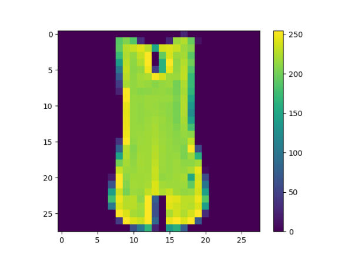
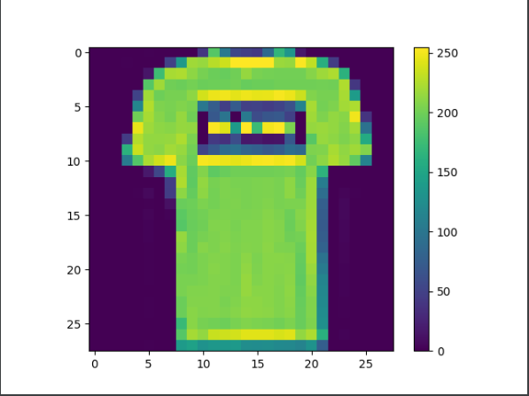
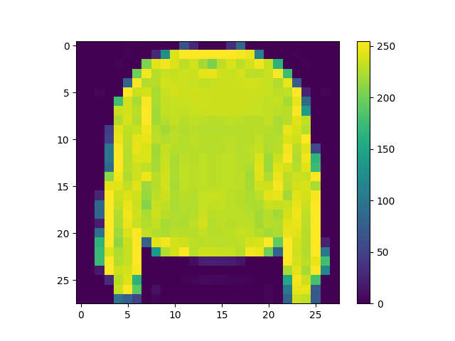
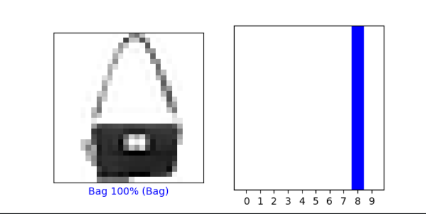
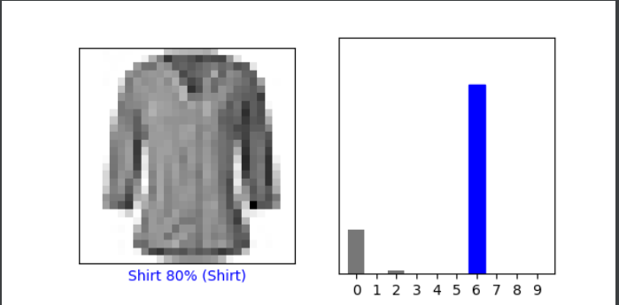
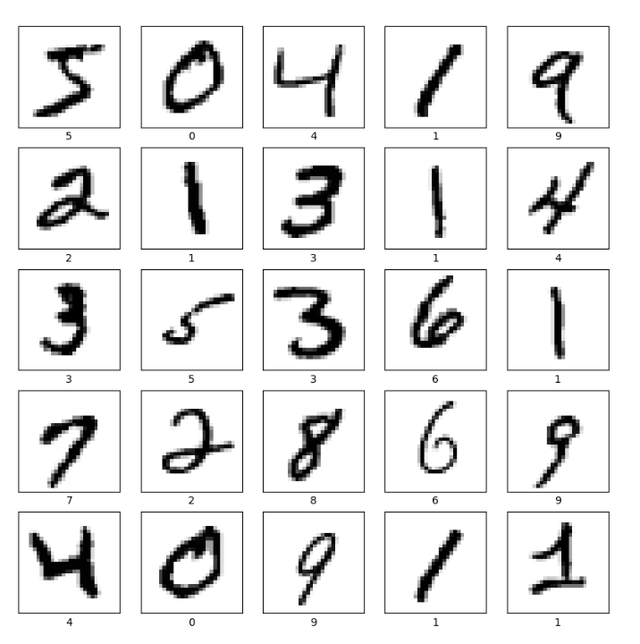
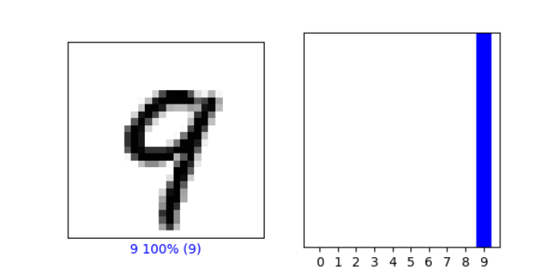
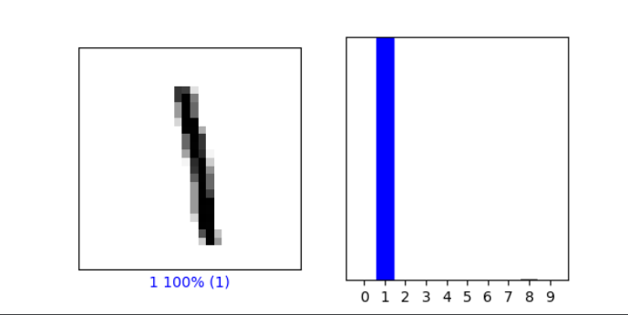

#### From the Preprocess the data section of the script, modify the training image to produce three new images.

__
#### Under the Make predictions section, present the array of predictions for an image from the test set other than the one given in the example script. What does this array represent?
array([1.15958005e-01, 1.35708582e-08, 1.05278669e-02, 5.81126311e-04,
6.65347418e-03, 4.15762571e-07, 8.66270125e-01, 7.07488912e-09,
8.09221183e-06, 7.77416687e-07], dtype=float32)

each number in the array represents the model's confidence that the image I picked corresponds to each of the 10 classifications.

#### How were the Softmax() and argmax() functions applied? What is the Softmax function?
softmax was used to change the label predictions to probabilities (from 0 to 1), and argmax was used to infer which of the probabilities had the highest value, and picked it (by assigning a 1 to it)

#### Does the output from np.argmax() match the label from your test_labels dataset?
yes, it does.

__
#### Under the Verify predictions section, plot two additional images (other than either of the two given in the example script) and include the graph of their predicted label as well as the image itself.

__
#### Under the Use the trained model section, again select a new image from the test dataset. Produce the predictions for this newly selected image. Does the predicted value match the test label? Although you applied the argmax() function in this second instance, you did not use Softmax() a second time. Why is that so (please be specific)?
yes, it does.
we did not use Softmax() this time because our probabilities for predictions were already produced previously in this code:

probability_model = tf.keras.Sequential([model,
tf.keras.layers.Softmax()])

However, we still need to decide which of the 10 classifications our new image corresponds to (which is what argmax() does), therefore we still had to use argmax().

____
#### Produce a plot of 25 handwritten numbers from the data with their labels indicated below each image.

#### Fit the model and report the accuracy of the training dataset. Likewise report the accuracy of the test dataset. 
Training accuracy: 0.9952 -- Testing accuracy: 0.9771

#### As in the above example, from the Verify predictions section, plot two images and include the graph of their predicted label as well as the image itself.

* #### Evaluate how your model for the MNIST dataset compared with your model of the Fashion_MNIST dataset. Which of the two models is more accurate? Why do you think this is so?

The models were similar in terms of execution and training. However, the MINST was more accurate than Fashion_MINST. MINST had a higher testing and training score. I believe this is because numbers, even though handwritten, do not vary as much as fashion or articles of clothing, therefore, they're easier to train AND predict.

