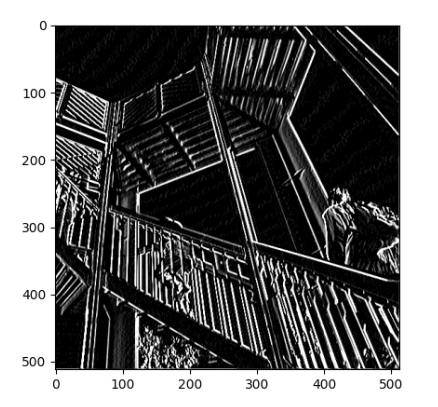
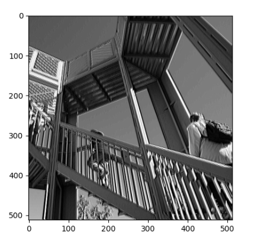
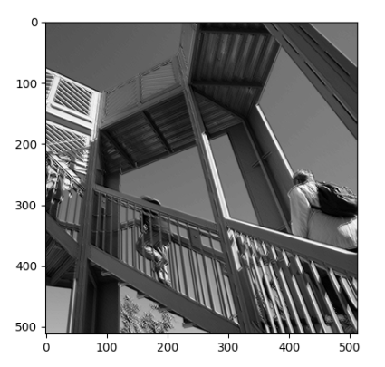
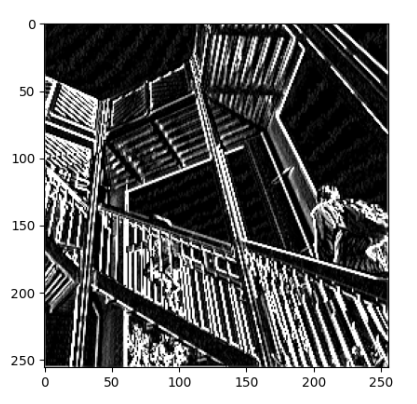

#### - Modify the existing filter and if needed the associated weight in order to apply your new filters to the image 3 times. Plot each result, upload them to your response, and describe how each filter transformed the existing image as it convolved through the original array and reduced the object size. What are you functionally accomplishing as you apply the filter to your original array?

[ [-4, -5, -4], [0, 0, 0], [4, 5, 4]]

My first filter darkened my background and brought forward my lines; mostly vertical lines. I can also see lines in the background that were not visible at all before.

[ [-2, 2, -2], [0, 1, 0], [2, -2, 2]]

This filter seemed to sharpen vertical lines such as the pillars

[ [1, 0, -1], [0, 0, 0], [0, 0, 1]]

this one looks a lot like the previous filter. except its more blurry so it seems to be doing a poorer job at bringing out the lines/features of the image.

#### - Why is the application of a convolving filter to an image useful for computer vision? 
Because it brings out the most important features that make up an image, so the computer learns to recognize objects better based on key features instead of an entire image taken as a whole, which can be very limiting.
___
#### - Another useful method is pooling. Apply a 2x2 filter to one of your convolved images, and plot the result. In effect what have you accomplished by applying this filter? 
Did the resulting image increase in size or decrease? 

I applied this to my first image/filter plotted. Now, the picture is a lot more accentuated; the lines were brought forward more and the background is even lighter now.

#### - Does there seem to be a logic (i.e. maximizing, averaging or minimizing values?) associated with the pooling filter provided in the example exercise (convolutions & pooling)?
It seems to maximize the values by minimizing the **amount** of values; in other words, it takes the largest number in each portion of values while discarding the rest.

#### - Did the resulting image increase in size or decrease?
it decreased the size.