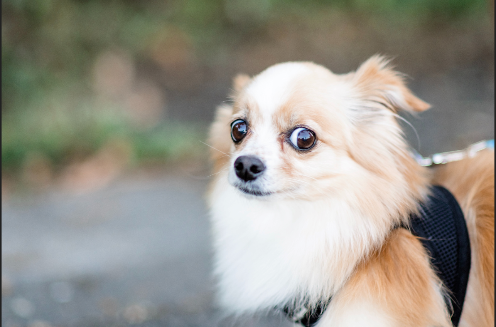
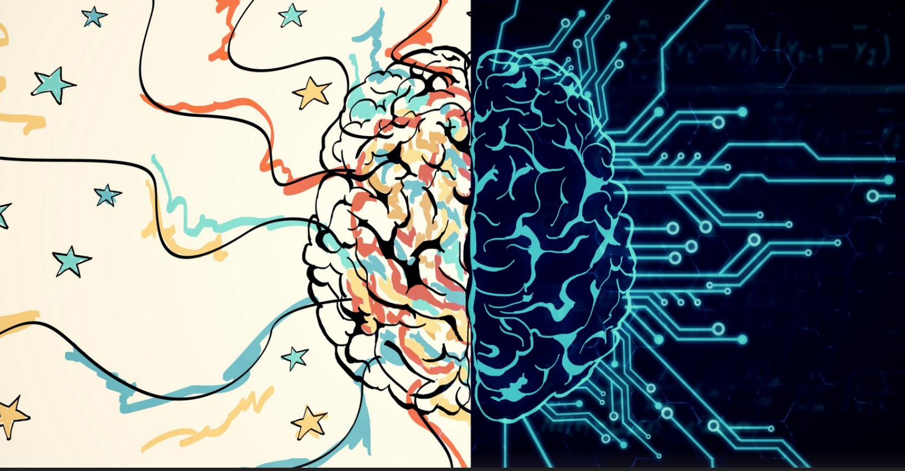
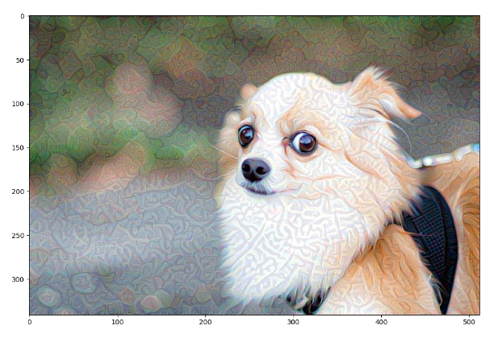
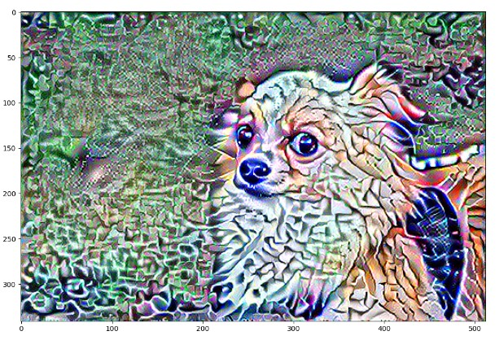
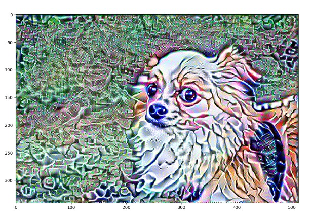

##Neural Style Transfer 

The two images I picked were the following:

 

Reasons: 
- The dog looks terrified and that's exactly how I felt choosing to minor in data science, diving headfirst into it with zero background knowledge/past experience, and taking 5 courses in one summer.
- The brain represents that I would learn a lot from the experience, the circuits in the right half of the picture represent machines and data, and this is what the jumpstart program was mostly about!

These were these steps of my result:

My produced image represents where I am right now after almost 10 weeks of the jump-start summer program. I am still terrified. Yes, I understand data and programming a **lot** more than I did coming into this, but there are times where it terrifies me still. My scared self (dog) has merged with the knowledge I learned, and now they exist together in one image. I think it's funny that the dog looks like it's glitching (both because I feel like I am glitching myself sometimes, and also because it's technology realted!)

